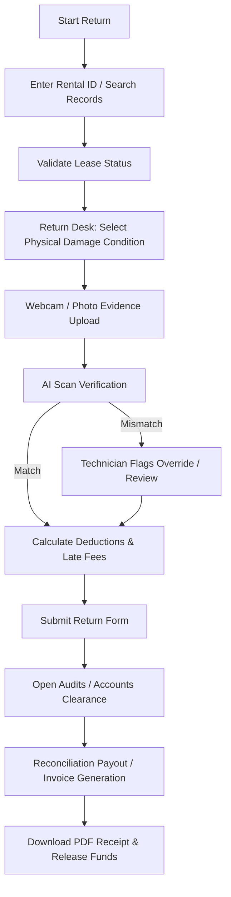
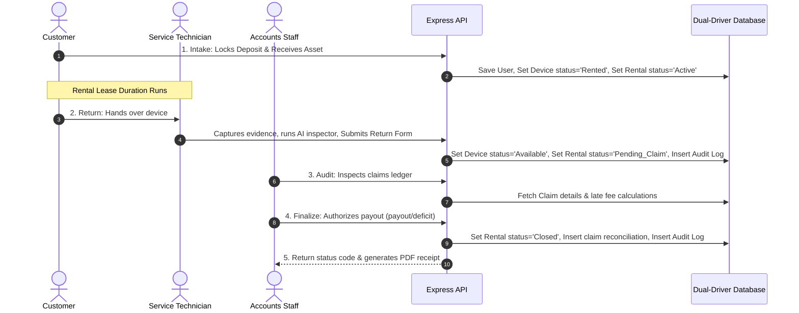

# System Analysis & Design Specification

This document outlines the frontend modules, user flow diagrams, backend data lifecycle, and system transactional sequences for the **RentShield CC** platform.

---

## 🖥️ Frontend Modules & User Flow Analysis

### 1. Key Operational Modules
- **Intake Form (Deposit Management)**:
  - Registers customer profiles, verifies KYC status, locks a custom security deposit, and issues a specific serial number to the customer.
- **Return Checklist & Intake Desk**:
  - Handles customer returns. Includes webcam streaming and photo uploads for physical verification, days-left indicators, and late return daily fee computations.
- **AI Damage Selector & Triage**:
  - Integrates computer-vision simulation matching captured images with selected damage categories (e.g. cracked screens, fluid intrusion, dents). Triggers an urgent technician triage protocol for critical states (such as Water Damage).
- **Settlement & Ledger Summary**:
  - Details the financial reconciliation. Calculates deductions, issues net payouts (refunds) or invoice deficits, logs settlement notes, and generates PDF receipts.

### 2. User Flow Diagram (Navigating from Return to Settlement)

---

## 🗄️ Backend Data Lifecycle & Sequence of Events

### 1. Relational Database Schema Mapping
The system tracks transactions across five primary tables:
- **`users`**: Contains customer identities, contact numbers, email addresses, and compliance statuses (`Verified`, `Pending`, `Rejected`).
- **`devices`**: Tracks asset serial numbers, model categories, hardware base values, and availability states (`Available`, `Rented`).
- **`rentals`**: Logs active leases, linking users to devices. Includes starting date, scheduled return date, locked security deposit held, and tracking state (`Active` / `'Held'`, `Pending_Claim` / `'Under Review'`, `Priority_Repair` / `'Isolated Repair'`, `Closed` / `'Settled'`).
- **`claims`**: Finalizes returns. Stores physical damage descriptions, severity damage deductions, overdue late fees, net refund totals, and payment methods.
- **`audit_logs`**: Logs step-by-step history of intakes, inspections, overrides, and financial clearances.

### 2. System Sequence Diagram (Data Event Loop)

